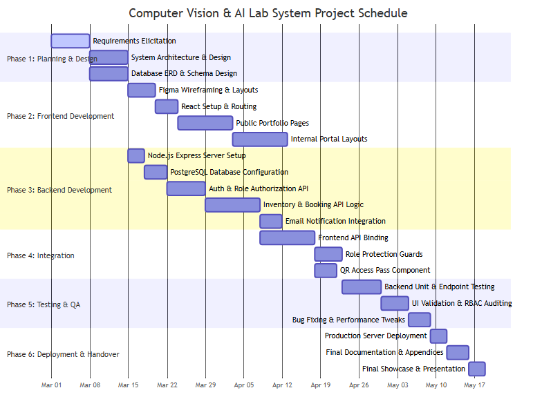
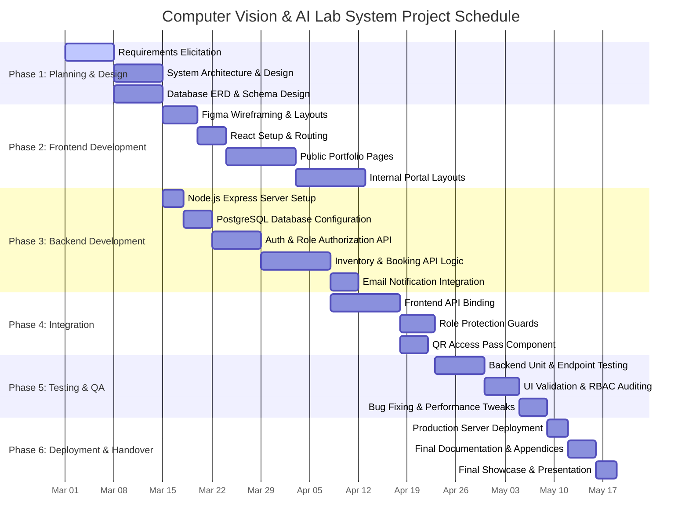

# Appendix C: Project Timeline & Gantt Chart

This appendix details the development roadmap, schedule, and phase breakdown for the **Computer Vision & AI Lab Management System** project over a standard 14-week lifecycle.

## Project Gantt Chart

The Gantt chart below illustrates the overlapping phases of planning, development, integration, testing, and deployment.

<b>Click to expand Mermaid Source Code</b>

---

## Phase Explanations & Deliverables

### 📅 Phase 1: Requirements Gathering & System Design (Weeks 1–2)
*   **Objective**: Understand structural bounds, define stakeholders, and layout logical architectures.
*   **Deliverables**:
    *   Requirement Specification Document.
    *   System Architecture Design (Decoupled Frontend React / Backend Express structure).
    *   UML Use Case Diagram (**Appendix A**).
    *   Entity-Relationship Diagram (**Appendix B**).

### 🎨 Phase 2: Frontend Development (Weeks 3–6)
*   **Objective**: Develop fully interactive mock interfaces for the public site and dashboard layouts.
*   **Deliverables**:
    *   Interactive public pages (Home, Research, Publications, Projects, Facilities).
    *   Portal layouts with protected routing shells for Student, Staff, and Admin views.
    *   Styling using TailwindCSS and custom theme stylesheets.

### ⚙️ Phase 3: Backend API Development (Weeks 7–9)
*   **Objective**: Establish a secure Node.js REST server connected to PostgreSQL for real-time CRUD operations.
*   **Deliverables**:
    *   Relational PostgreSQL schemas successfully deployed on host servers.
    *   Authentication controllers enabling secure registration and JWT validation.
    *   Endpoints serving inventory CRUD actions, reservation entries, and status updates.
    *   Email notification integrations sending automated status alerts.

### 🔗 Phase 4: Integration (Weeks 10–11)
*   **Objective**: Bind the interactive frontend dashboards to live backend endpoints.
*   **Deliverables**:
    *   Dynamic booking form processing client inputs to database rows.
    *   Access guards blocking unauthorized routes depending on verified tokens.
    *   Auto-generated SVG QR codes rendering validated reservation ids.

### 🧪 Phase 5: Testing & Quality Assurance (Weeks 12–13)
*   **Objective**: Audit safety constraints, test edge-case inputs, and optimize API speeds.
*   **Deliverables**:
    *   Unit and integration tests coverage.
    *   Permission and authentication validation logs.
    *   Optimized SQL query indexes for scheduling pipelines.

### 🚀 Phase 6: Deployment & Handover (Week 14)
*   **Objective**: Deploy the full-stack web application onto production cloud servers and deliver the final handover documentation.
*   **Deliverables**:
    *   Live URL for backend server.
    *   Live URL for frontend client.
    *   Fully documented codebase repositories, user guides, and appendices.
